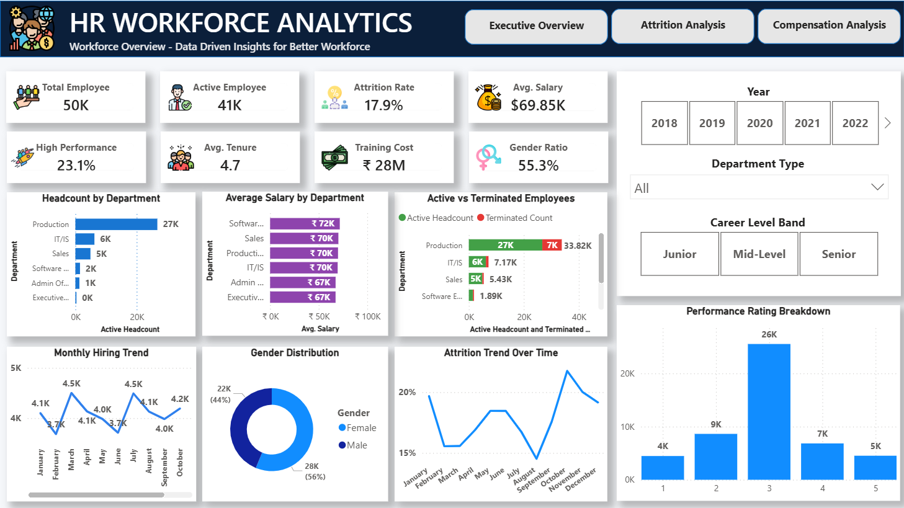
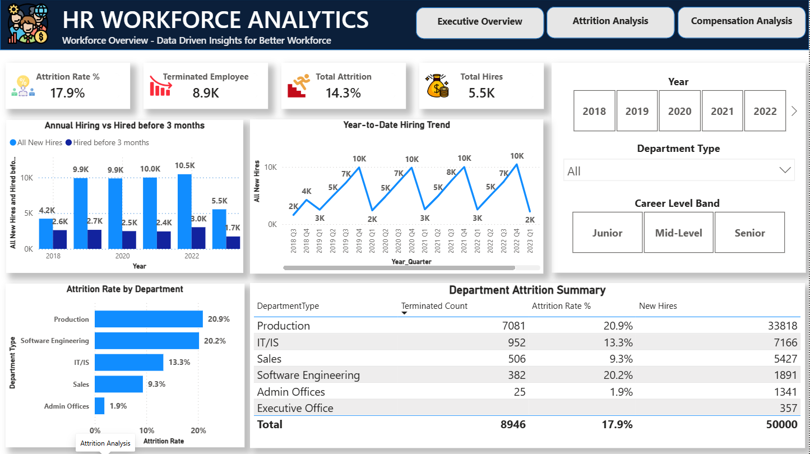
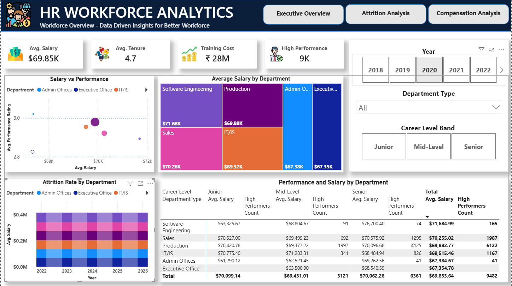
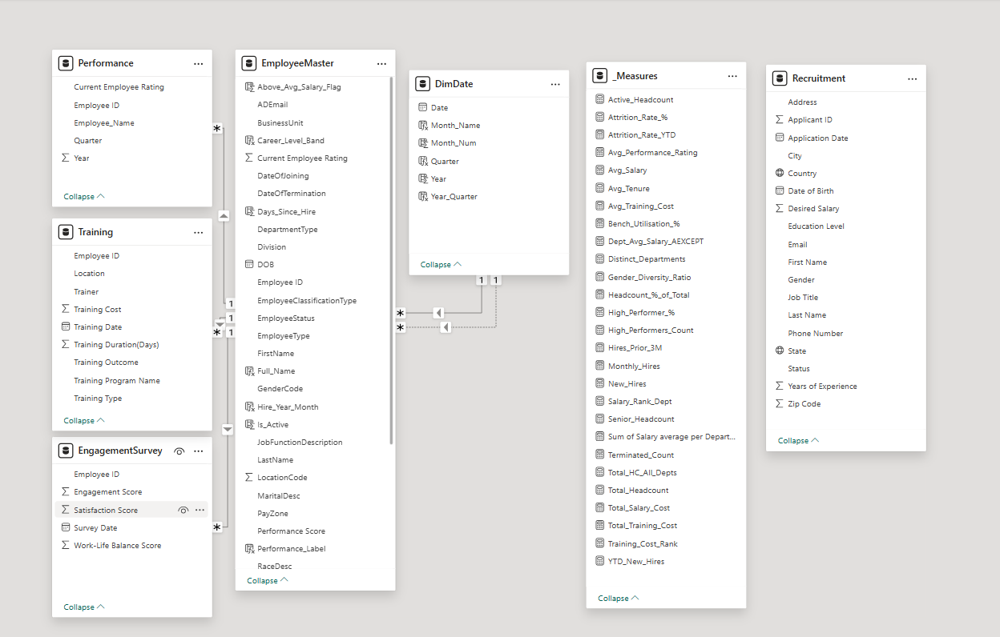

# 🚀 HR Workforce Analytics Dashboard


<p align="center">


 


</p>

> ### Workforce Overview • Attrition Analysis • Compensation Analysis

------------------------------------------------------------------------

## 📑 Table of Contents

-   [Overview](#overview)
-   [Business Problem](#business-problem)
-   [Dashboard Preview](#dashboard-preview)
-   [Features](#features)
-   [Project Workflow](#project-workflow)
-   [Dashboard Pages](#dashboard-pages)
-   [Data Model](#data-model)
-   [DAX Highlights](#dax-highlights)
-   [Insights](#business-insights)
-   [Tech Stack](#tech-stack)
-   [Repository Structure](#repository-structure)
-   [Future Improvements](#future-improvements)

------------------------------------------------------------------------

# Overview

An end-to-end **HR Workforce Analytics Dashboard** developed in **Power
BI** to transform HR operational data into actionable executive
insights.

## Business Problem

HR leaders need one place to monitor:

-   👥 Workforce size
-   📉 Attrition
-   💰 Compensation
-   📈 Performance
-   🎓 Training
-   🚀 Hiring trends

------------------------------------------------------------------------

# Dashboard Preview

## 🏠 Executive Overview



## 📉 Attrition Analysis



## 💰 Compensation Analysis



------------------------------------------------------------------------

# Features

-   ✅ Executive KPI Cards
-   ✅ Dynamic Slicers
-   ✅ Cross Filtering
-   ✅ Date Intelligence (YTD)
-   ✅ Interactive Navigation
-   ✅ Department Analysis
-   ✅ Compensation Analytics
-   ✅ Attrition Analytics
-   ✅ Performance Analytics
-   ✅ HR Executive Reporting

------------------------------------------------------------------------

# Project Workflow

``` text
CSV Files
   │
   ▼
Power Query ETL
   │
   ▼
Cleaning & Transformation
   │
   ▼
Star Schema Data Model
   │
   ▼
Relationships
   │
   ▼
DAX Measures
   │
   ▼
Interactive Dashboards
   │
   ▼
Business Insights
```

------------------------------------------------------------------------

# Dashboard Pages

## 1️⃣ Executive Overview

-   Workforce KPIs
-   Headcount by Department
-   Salary by Department
-   Active vs Terminated
-   Monthly Hiring Trend
-   Gender Distribution
-   Performance Rating

## 2️⃣ Attrition Analysis

-   Attrition KPIs
-   Hiring Trend
-   Hiring vs Early Attrition
-   Department Attrition
-   Department Summary Table

## 3️⃣ Compensation Analysis

-   Salary vs Performance Scatter
-   Salary Treemap
-   Salary Heatmap
-   Performance Matrix
-   Compensation KPIs

------------------------------------------------------------------------

# Data Model



### Fact Tables

-   Employee
-   Recruitment
-   Training
-   Performance
-   Engagement Survey

### Dimension

-   DimDate

------------------------------------------------------------------------

# DAX Highlights

-   Total Headcount
-   Active Employees
-   Attrition Rate
-   YTD New Hires
-   Monthly Hiring
-   Average Salary
-   High Performers
-   Gender Ratio
-   Average Tenure
-   Training Cost

------------------------------------------------------------------------

# Business Insights

📌 Production has the largest workforce.

📌 Salary distribution varies significantly across departments.

📌 Attrition trends can be monitored dynamically by year.

📌 Executive dashboard supports interactive HR decision making.

------------------------------------------------------------------------

# Tech Stack

  Technology         Usage
  ------------------ -----------------
  Power BI Desktop   Dashboard
  Power Query        ETL
  DAX                Calculations
  CSV                Source Data
  Git & GitHub       Version Control

------------------------------------------------------------------------

# Repository Structure

``` text
HR_Workforce_Analytics/
│
├── Assets/
├── Dataset/
├── Screenshots/
│   ├── Executive_Overview.png
│   ├── Attrition_Analysis.png
│   ├── Compensation_Analysis.png
│   └── Model_View.png
├── HR_Workforce_Analytics_Dashboard.pbix
└── README.md
```

------------------------------------------------------------------------

# Future Improvements

-   Power BI Service deployment
-   Row Level Security
-   Mobile Layout
-   Drill-through pages
-   Bookmarks & Storytelling
-   Forecasting
-   AI Visuals

------------------------------------------------------------------------

# Skills Demonstrated

`Power BI` • `Power Query` • `DAX` • `Data Modeling` •
`Dashboard Design` • `Business Intelligence` • `HR Analytics`

------------------------------------------------------------------------

## ⭐ If you enjoyed this project, consider giving the repository a Star!
